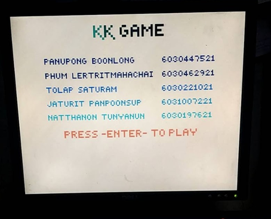
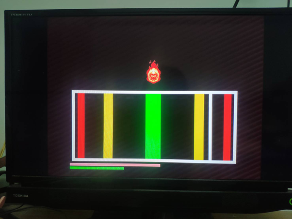
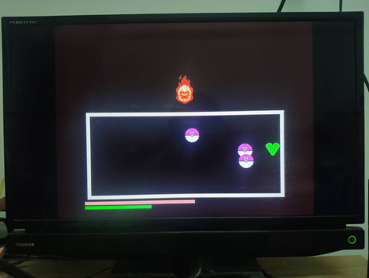

# kkGames
`Undertale`, RPG game, developed with `VerilogHDL` on `digilent basys3 (Xilinx Artix-7 FPGA Board)`

Project Description VDO in Thai: [Youtube](https://www.youtube.com/playlist?list=PLegpEypc2-JNJdZa3oJGvshh3nUPRhBiQ)

## Demo

### First Page

### First Boss

### Last Boss

